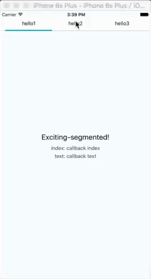

# exciting-segmented
ios&amp;android segmented


##EX
```javascript
<Segmented
            dataSource={['hello1', 'hello2', 'hello3']}    //data(required)
    	    onPress={(index, text) => {}}                  //callback(required)
            fontSize={14} fontSize={"#000"}
            backgroundColor={"#000"}
            bottomColor={"#000"}
            borderColor={"#ccc"}

/>
```


##USE

* step1: `npm i --save exciting-segmented`
* step2: `import Segmented from 'exciting-segmented'`
* step3: `<Segmented dataSource={['text']}/>`


##PROBLEM

* MAIL(nanazuimeng123#gmail.com) # => @
* TWITTER: [@VitAslEe](https://twitter.com/VitAslEe)
* ISSUES: [issues](https://github.com/WittBulter/exciting-segmented/issues)

